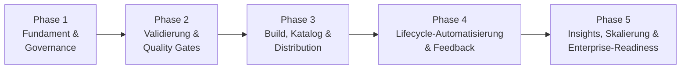

# 🛣️ Skill Marketplace — Roadmap

Diese Roadmap führt den Skill Marketplace vom heutigen PoC zu einem voll
governten, automatisierten und selbsttragenden Asset. Sie ist in **5 Phasen**
gegliedert. **Mit Abschluss von Phase 5 ist jedes Feature umgesetzt**, das in
der Konzeptdiskussion (Git vs. File Share · Deployment-Pipeline · Lifecycle
Management) genannt wurde — siehe [Traceability-Matrix](#-traceability-matrix)
am Ende.

> **Plattform-Entscheidung:** Alles wird **vorerst GitHub-nativ** realisiert
> (GitHub Repo · Actions · Pages · Issues · Releases). Der Migrationspfad in ein
> Enterprise-Setup (Azure DevOps / Entra ID SSO) ist in Phase 5 **dokumentiert,
> aber bewusst nicht ausgeführt**.

---

## Überblick

| Phase | Thema | Kernergebnis |
|-------|-------|--------------|
| **0** | *Baseline (erledigt)* | Git-Repo, 5 Skills, Build-Skript, Auto-Deploy auf Pages, Website im SBO-Design |
| **1** | Fundament & Governance | Verbindliches Metadaten-Schema, Lifecycle-Felder, Ownership, niedrigschwellige Beiträge |
| **2** | Validierung & Quality Gates | Kein kaputter Skill kommt mehr durch — CI erzwingt Qualität vor dem Merge |
| **3** | Build, Katalog & Distribution | Maschinenlesbarer Katalog, Status-Badges, Versionierung, CLI-Installation |
| **4** | Lifecycle-Automatisierung & Feedback | Skills bleiben über die Zeit gesund; Feedback- & Benachrichtigungsschleifen |
| **5** | Insights, Skalierung & Enterprise-Readiness | Datengetriebene Pflege, Governance im Maßstab, dokumentierter Enterprise-Pfad |

---

## Phase 0 — Baseline *(erledigt)*

Ausgangspunkt, auf dem alles aufbaut:

- [x] Git als Single Source of Truth (`skills/<name>/metadata.json` + `SKILL.md`)
- [x] `scripts/build_site.py` generiert die statische Website aus `skills/`
- [x] GitHub Actions Workflow deployt automatisch auf GitHub Pages bei Push
- [x] `CONTRIBUTING.md` dokumentiert das Beitragsformat
- [x] Website (Konsum-Schicht) im SBO-Corporate-Design

---

## Phase 1 — Fundament & Governance

**Ziel:** Bevor automatisiert wird, muss der Standard sitzen. Wir definieren ein
verbindliches Datenmodell inkl. Lifecycle-Feldern und legen Ownership fest.

### Deliverables
- [x] **Erweitertes Metadaten-Schema** — neue Pflicht-/Optionalfelder in jeder `metadata.json`:
  - `status` — `draft | in-review | published | deprecated | archived`
  - `version` — SemVer (Breaking Change → Major) *(Feld existiert, Konvention wird verbindlich)*
  - `owner` — verantwortliche Person/Team (koppelt an CODEOWNERS)
  - `last_reviewed` — Datum der letzten Überprüfung (ISO `YYYY-MM-DD`)
  - `deprecated_by` — ID des Nachfolge-Skills (nur bei `deprecated`)
  - `sunset_date` — geplantes Ausserkraftsetzungs-Datum (nur bei `deprecated`)
  - `changelog` — Liste `{version, date, change}` pro Version
  - `example_input` — Beispiel-Input (später für Smoke-Tests in Phase 4)
- [x] **Formales JSON-Schema** unter `schema/skill.schema.json` (definiert Pflichtfelder, Typen, erlaubte Enum-Werte). Grundlage für die Validierung in Phase 2.
- [x] **Lifecycle-Modell dokumentiert**: `Draft → In Review → Published → Maintained → Deprecated → Archived` (in `CONTRIBUTING.md` + `MAINTAINERS.md`).
- [x] **`CODEOWNERS`** (`.github/CODEOWNERS`) — pro Skill-Ordner und pro Kategorie ein verantwortlicher Reviewer.
- [x] **`MAINTAINERS.md`** — benennt Repo-Maintainer und **Taxonomie-Owner** (verantwortlich für die Kategorie-/Tag-Struktur).
- [x] **Contribution-Flow für Business-User (niedrigschwellig):**
  - [x] **Issue-Formular** `.github/ISSUE_TEMPLATE/new-skill.yml` („Neue Skill vorschlagen") mit strukturierten Feldern — Nicht-Techniker müssen kein Git kennen. **„Skill vorschlagen"-Button auf der Website verlinkt direkt darauf.**
  - [x] **PR-Template** `.github/pull_request_template.md` mit Checkliste (Schema erfüllt? Owner gesetzt? Changelog aktualisiert?).
- [x] **Migration der 5 bestehenden Skills** auf das neue Schema (Backfill der neuen Felder).
- [x] *(aus Phase 2 vorgezogen)* **`scripts/validate_skills.py`** — lokales Validierungsskript (Schema + Struktur-Checks).
- [x] *(aus Phase 3 vorgezogen)* **Katalog-Manifest `docs/catalog.json`** — maschinenlesbarer Index, wird bei jedem Build erzeugt; `archived`-Skills werden aus Site & Katalog ausgeblendet; Schema wird unter `/schema/skill.schema.json` mitpubliziert.

### GitHub-Umsetzung
Reine Repo-Artefakte (JSON-Schema, `.github/`-Vorlagen, Markdown). Kein Code-Deploy nötig.

### Exit-Kriterium
Alle bestehenden Skills validieren gegen `schema/skill.schema.json`; ein Business-User kann über das Issue-Formular einen Skill vorschlagen.

---

## Phase 2 — Validierung & Quality Gates (CI)

**Ziel:** Nichts Kaputtes kommt mehr in `main`. Die Pipeline erzwingt Qualität
**vor** dem Merge — Stufe „VALIDATE" und „REVIEW" aus dem Pipeline-Konzept.

### Deliverables
- [x] **CI-Validierungs-Workflow** `.github/workflows/validate.yml` (Trigger: Pull Request + Push auf `main`), der ausführt:
  - [x] **Schema-Validierung** jeder `metadata.json` gegen `schema/skill.schema.json` (Python `jsonschema`).
  - [x] **`SKILL.md`-Lint**: Frontmatter vorhanden? Mindestlänge? (Beschreibungslänge via Schema erzwungen.)
  - [x] **Naming-Konvention**: Ordnername = `id`, kebab-case, keine Sonderzeichen.
  - [x] **Eindeutigkeits-Check**: keine doppelten `id`s im gesamten Repo.
  - [x] **Broken-Link-Check** in `SKILL.md` und Metadaten (`deprecated_by` zeigt auf existierende Skill-ID; relative Links müssen auflösen).
  - [x] **Build-Smoke-Test**: Website + `catalog.json` müssen fehlerfrei bauen.
- [x] **`scripts/validate_skills.py`** — wiederverwendbares Validierungsskript (lokal + in CI ausführbar). *(in Phase 1 vorgezogen)*
- [x] **Branch Protection** auf `main`: Merge nur bei (a) grüner Validierung und (b) mind. 1 Review durch CODEOWNER. (`enforce_admins=false`: der Repo-Admin kann als Solo-Maintainer weiterhin direkt pushen; alle anderen müssen durch den Gate.)
- [x] **Status-Checks** als „Required" markiert (`validate`, strict mode).
- [x] **E2E-verifiziert**: PR #1 mit absichtlich kaputter `metadata.json` → Check rot nach 15 s, `mergeable_state: blocked`.

### GitHub-Umsetzung
GitHub Actions (`validate.yml`) + Branch-Protection-Rules in den Repo-Settings. `validate_skills.py` nutzt `jsonschema`.

### Exit-Kriterium
Ein PR mit fehlerhafter `metadata.json` wird automatisch rot und ist nicht mergebar; ein valider PR benötigt Review-Freigabe.

---

## Phase 3 — Build, Katalog & Distribution

**Ziel:** Der Marketplace wird maschinenlesbar, versioniert und installierbar —
Stufen „BUILD" und „DEPLOY" plus Distribution.

### Deliverables
- [x] **Katalog-Manifest** `docs/catalog.json` — beim Build generiert; maschinenlesbarer Index aller Skills (Name, Version, Kategorie, Status, Download-URL). Grundlage für programmatischen Zugriff. *(in Phase 1 vorgezogen)*
- [x] **Status-Badges auf der Website** — jeder Skill zeigt `draft`/`in-review`/`deprecated`-Badge (aus `status`; `published` bleibt badge-frei).
- [x] **Deprecation-Handling auf der Website:**
  - [x] Banner bei `deprecated` inkl. `sunset_date` und klickbarem „ersetzt durch → `deprecated_by`"-Link (deprecatete Karten sind zusätzlich abgedimmt).
  - [x] `archived`-Skills werden aus dem Katalog **ausgeblendet** (bleiben im Repo für Provenienz). *(in Phase 1 vorgezogen)*
- [x] **Automatisierte Versionierung**: `release.yml` legt bei Push auf `main` (Skill-Änderung) je Skill Tag `id@version` + **GitHub Release** an; alte Versionen bleiben über Releases abrufbar. Idempotent.
- [x] **Distribution als Paket**: `SKILL.md`+`metadata.json` je Skill als Release-Asset — versionierter, referenzierbarer Download.
- [x] **CLI `skill install <name>`** (`scripts/skill_cli.py`) — liest `catalog.json`, lädt den Skill herunter, legt ihn harness-korrekt ab (`.claude/skills/` etc.). Unterbefehle: `list`, `search`, `info`, `install`. Nur Standardbibliothek.
- [x] **Issue-→-PR-Automatisierung** — `scaffold-skill.yml` erzeugt aus einem ausgefüllten „Neue Skill"-Issue die Ordnerstruktur, pusht einen Branch und öffnet einen PR (schließt das Issue). Business-User sehen nie Git.

**Harness-Distribution (Claude Code)** — damit alle Anwender automatisch immer alle aktuellen Skills haben:
- [x] **Repo als Claude-Code-Plugin-Marketplace**: `.claude-plugin/marketplace.json` + `.claude-plugin/plugin.json`. Ein einziges Plugin `sbo-skills` bündelt **alle** veröffentlichten Skills (`skills/<id>/SKILL.md`) → neue Skills fließen automatisch mit.
- [x] **SHA-Pinning**: kein festes `version` im Manifest → Plugin folgt dem `main`-HEAD; jeder Merge = neuer Stand.
- [x] **Org-weite Auto-Bereitstellung** dokumentiert (`docs/enterprise-setup.md`): Managed-Settings-JSON (`extraKnownMarketplaces` + `enabledPlugins` + `autoUpdate`) für Teams/Enterprise (kein Nutzer-Zutun) sowie Ein-Befehl-Variante für Einzel-Accounts.
- [x] Kanonische Skill-Datei auf `SKILL.md` umgestellt (Claude-Code-Konvention); Build, Validator, CLI, Scaffold angepasst.

### GitHub-Umsetzung
Erweiterung von `build_site.py` (catalog.json, Badges, Deprecation-Banner, Archiv-Filter); neue Actions für Tagging/Release und Issue→PR; `skill_cli.py` als eigenständiges Skript.

### Exit-Kriterium
`catalog.json` ist live abrufbar; ein Skill lässt sich per CLI installieren; ein deprecateter Skill zeigt Banner, ein archivierter verschwindet aus dem Katalog; ein Issue kann automatisch zum PR werden.

---

## Phase 4 — Lifecycle-Automatisierung & Feedback

**Ziel:** Der Marketplace pflegt sich weitgehend selbst und schließt die
Feedback-Schleife — Stufen „QUALITY" und „NOTIFY" plus Health-Management.

### Deliverables
- [ ] **Stale-Detection** — geplanter Workflow (`schedule`/Cron), der Skills mit `last_reviewed` älter als *X* Monate erkennt und automatisch ein **„Review fällig"-Issue** an den `owner` erstellt.
- [ ] **Model-Drift-Revalidierung** — geplanter Workflow, der Skills periodisch gegen die **aktuelle Modell-Version** testet (Prompts veralten nicht nur inhaltlich, sondern durch Modellwechsel).
- [ ] **Smoke-Test in CI** — nutzt `example_input`: schickt den Skill an ein LLM (Anthropic API via Secret) und prüft die **Output-Form**.
- [ ] **Prompt-Injection- & PII-Scan** — CI-Check auf verdächtige Muster/sensible Daten in `SKILL.md`.
- [ ] **Feedback-Schleife auf der Website:**
  - [ ] **„War das hilfreich?"**-Bewertung pro Skill (GitHub-nativ: öffnet ein vorausgefülltes Issue bzw. nutzt GitHub-Discussions-Reaktionen als Zähler).
  - [ ] **„Problem melden"-Link** pro Skill (vorausgefülltes Bug-Issue mit Skill-ID).
- [ ] **Benachrichtigungen (NOTIFY)** — Action postet bei neuem/aktualisiertem Skill in einen **Teams-Webhook** (und/oder E-Mail).
- [ ] **Auto-Archivierung** — geplanter Workflow, der `deprecated`-Skills nach Erreichen des `sunset_date` automatisch nach `archived/` verschiebt (per PR).

### GitHub-Umsetzung
Mehrere `schedule`-Workflows (Cron); LLM-Aufrufe über in Repo-Secrets hinterlegten API-Key; Teams über Incoming Webhook; Feedback über GitHub Issues/Discussions (kein externer Server nötig).

### Exit-Kriterium
Ein überfälliger Skill erzeugt automatisch ein Review-Issue; ein neuer Skill löst eine Teams-Benachrichtigung aus; Nutzer können pro Skill Feedback geben; abgelaufene Deprecations werden automatisch archiviert.

---

## Phase 5 — Insights, Skalierung & Enterprise-Readiness

**Ziel:** Die Schleife wird datengetrieben geschlossen, Governance skaliert, und
der Weg über GitHub hinaus ist vorbereitet.

### Deliverables
- [ ] **Usage-/Nutzungs-Tracking** — Auswertung der Skill-Nutzung (Download-Zähler der GitHub Releases; optional privacy-freundliches Web-Analytics) → sichtbar auf einem **Insights-Dashboard** der Website.
- [ ] **Datengetriebene Pflege-Priorisierung** — Kombination aus Nutzung + Feedback + Alter priorisiert automatisch, welche Skills gepflegt/überarbeitet werden sollen (z. B. „Top genutzt & lange nicht reviewed" zuerst).
- [ ] **Governance im Maßstab** — Taxonomie-Owner-Prozess (aus Phase 1) wird bei wachsender Skill-Zahl durchgesetzt: Kategorie-Reviews, Konsolidierung von Tags, Qualitätskennzahlen je Kategorie.
- [ ] **End-to-End-Pipeline verdrahtet** — alle Stufen (VALIDATE → QUALITY → REVIEW → BUILD → DEPLOY → NOTIFY) laufen als durchgängiger, dokumentierter Fluss.
- [ ] **Retirement-Prozess vollständig** — sauberer, automatisierter Weg von `published` bis `archived` inkl. Provenienz-Erhalt.
- [ ] **Enterprise-Readiness (dokumentiert, nicht ausgeführt)** — Migrationsleitfaden GitHub → **Azure DevOps Repos / Azure Pipelines / Azure Static Web Apps** mit **Entra ID (SSO)** und internen Berechtigungen, damit der Marketplace bei Bedarf in den SBO-Tenant überführt werden kann. Die Architektur ist 1:1 übertragbar.

### GitHub-Umsetzung
Insights aus Release-Download-Statistiken (GitHub API) + optionalem Analytics; Priorisierungs-Report als geplanter Workflow; Migrationsleitfaden als `docs/enterprise-migration.md`.

### Exit-Kriterium
Ein Insights-Dashboard zeigt Nutzung; ein automatischer Report priorisiert Pflegeaufwand; der komplette Lifecycle läuft automatisiert; der Enterprise-Migrationspfad ist dokumentiert.

---

## 🧭 Traceability-Matrix

Jedes in der Konzeptdiskussion genannte Feature, seiner Phase zugeordnet.
Nach Phase 5 sind **alle** Einträge erledigt.

### Git vs. File Share
| # | Feature | Phase |
|---|---------|-------|
| 1 | Git als Single Source of Truth | 0 ✅ |
| 2 | Website als Konsum-Schicht | 0 ✅ |
| 3 | Niedrigschwelliger Beitrag: „Neue Skill"-Issue-Formular | 1 |
| 4 | Web-Formular/Issue-→-PR-Automatisierung (Business-User ohne Git) | 3 |
| 5 | Enterprise-Pfad Azure DevOps / Entra ID SSO (dokumentiert) | 5 |

### Deployment-Pipeline
| # | Feature | Phase |
|---|---------|-------|
| 6 | JSON-Schema-Validierung der `metadata.json` (Pflichtfelder, Typen) | 2 |
| 7 | `SKILL.md`-Lint (Frontmatter, Beschreibungslänge, Pflichtabschnitte) | 2 |
| 8 | Naming-Konventions-Check | 2 |
| 9 | Eindeutigkeits-Check der IDs | 2 |
| 10 | Broken-Link-Check | 2 |
| 11 | Prompt-Injection-/PII-Scan | 4 |
| 12 | Smoke-Test (Skill + Beispiel-Input → LLM → Output-Form) | 4 |
| 13 | Menschliches Review / PR-Approval (Branch Protection) | 2 |
| 14 | CODEOWNERS | 1 |
| 15 | BUILD der Website | 0 ✅ |
| 16 | Katalog-Manifest `catalog.json` (maschinenlesbar) | 3 |
| 17 | SemVer-Versionierung + Git-Tags/Releases | 1 (Konvention) · 3 (Automatisierung) |
| 18 | DEPLOY auf GitHub Pages | 0 ✅ |
| 19 | NOTIFY (Teams/E-Mail bei neuem Skill) | 4 |
| 20 | CLI `skill install <name>` | 3 |
| 21 | Distribution als Paket (Releases/GitHub Packages) | 3 |

### Lifecycle Management
| # | Feature | Phase |
|---|---------|-------|
| 22 | Lifecycle-Modell `Draft→…→Archived` definiert | 1 |
| 23 | Metadatum `status` | 1 |
| 24 | Metadatum `version` (SemVer) | 1 |
| 25 | Metadatum `owner` | 1 |
| 26 | Metadatum `last_reviewed` | 1 |
| 27 | Metadatum `deprecated_by` | 1 |
| 28 | Metadatum `changelog` | 1 |
| 29 | Ownership pro Skill (CODEOWNERS-Kopplung) | 1 |
| 30 | Taxonomie-/Kategorie-Owner | 1 (definiert) · 5 (durchgesetzt) |
| 31 | Contribution-Guidelines (`CONTRIBUTING.md`) | 0 ✅ · 1 (verfeinert) |
| 32 | Stale-Detection (>X Monate → Flag/Issue) | 4 |
| 33 | Model-Drift-Revalidierung | 4 |
| 34 | Feedback: „War das hilfreich?"-Bewertung | 4 |
| 35 | Feedback: „Problem melden"-Link pro Skill | 4 |
| 36 | Usage-Tracking (Downloads/Nutzung) → Priorisierung | 5 |
| 37 | Deprecation-Banner + `sunset_date` + Migrationshinweis | 1 (Feld) · 3 (Website) |
| 38 | Retirement = nach `archived/`, aus Katalog ausgeblendet, Provenienz erhalten | 3 (Ausblenden) · 4 (Auto-Archiv) |
| 39 | Status-Badges auf der Website | 3 |

### Harness-Distribution (Claude Code)
| # | Feature | Phase |
|---|---------|-------|
| 40 | Repo als Claude-Code-Plugin-Marketplace (`.claude-plugin/marketplace.json` + `plugin.json`) | 3 |
| 41 | Ein Plugin `sbo-skills` bündelt alle Skills; SHA-Pinning → immer aktuell | 3 |
| 42 | Org-weite Auto-Bereitstellung via Managed Settings (dokumentiert) + Ein-Befehl-Variante | 3 |

---

*Diese Roadmap ist ein lebendes Dokument. Häkchen werden pro Phase im Repo gepflegt.*
